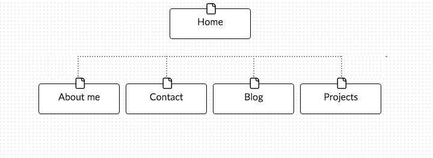

## Sitemap Design Reflection

**What are the 6 Phases of Web Design?**
**What is your site's primary goal or purpose? What kind of content will your site feature?**
**What is your target audience's interests and how do you see your site addressing them?**
**What is the primary "action" the user should take when coming to your site? Do you want them to search for information, contact you, or see your portfolio? It's ok to have several actions at once, or different actions for different kinds of visitors.**
**What are the main things someone should know about design and user experience?**
**What is user experience design and why is it valuable?**
**Which parts of the challenge did you find tedious?**

- 6 Phases of Web Design
  1. Information gathering
  2. Planning
  3. Design
  4. Development
  5. Testing + Delivery
  6. Maintenance
- This site's purpose is to serve as an online resume and professional portfolio. The site will include an about me section, contact info, a link to my blog, and my projects.
- My target audience is most likey interested in hiring me and seeing my work. I see my site including all the information a hiring manager would want to see, first being my projects, a blog, and my contact information of course.
- The primary 'action' I want the user to take is to see my projects to get a sense of my work. Then if they are intersted in contacting me, that information is easily accessible for them.
- When it comes to designing based on user experience principles, it's important to make design decisions based on the needs and wants of the user. This is crucial because designs made with the user in mind will attract *regular* users, as opposed to one-time users.
- The world wide web experience, from browsing websites, to consuming media and shopping, users are constantly dealing with complex and highly interactive websites. But it's not like they're especially hard to navigate just because they're complex. User experience design is what makes complex sites easily navigable. Amazon is a great example of successful user experience design applied to a complex system.
- I didn't find any part of the challenge tedious. It's exciting that we're building our personal professional sites!