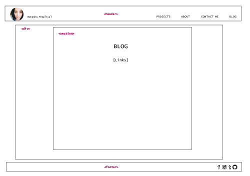

## Wireframe Reflection

- *What is a wireframe?*
- *What are the benefits of wireframing?*
- *Did you enjoy wireframing your site?*
- *Did you revise your wireframe or stick with your first idea?*
- *What questions did you ask during this challenge? What resources did you find to help you answer them?*
- *Which parts of the challenge did you enjoy and which parts did you find tedious?*

- A wireframe is a blueprint for a website that organizes the layout of the site's information. A basic wireframe usually includes the header, nav, body, and footer tags.
- Wireframing is really important because it allows the web designer to get a skeleton view of the site, making iterations to the design quick and easy. It's always much harder to try to change formatting and layout during the development stage, so it's best to get a solid layout down on paper or as an image file.
- I've had an idea for my professional site for a while so I worked off that idea, but I tweaked it a bit during this iteration.
- I was trying to keep in mind how the user would interact with my site, and more importantly how the user would navigate through it from one page to the next.
- I really enjoyed putting my idea on paper; it excites me to think of the endless possibilities of how a website can look.