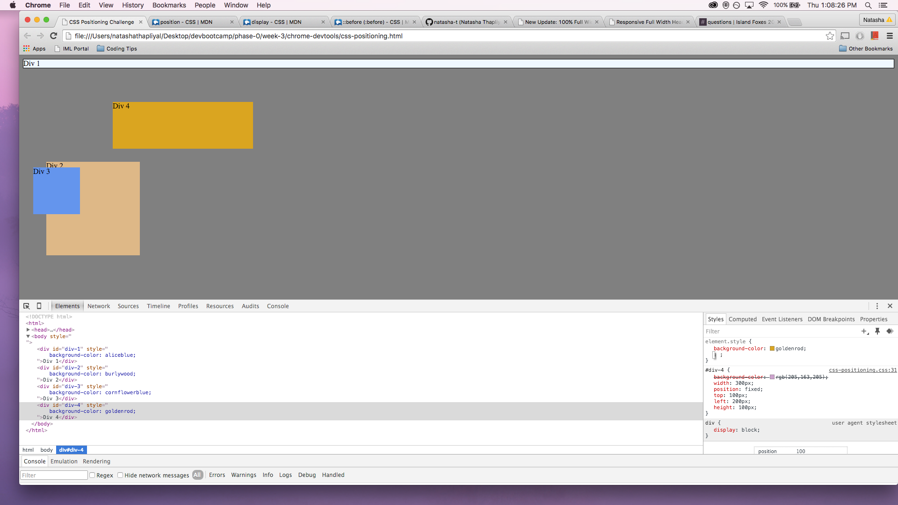
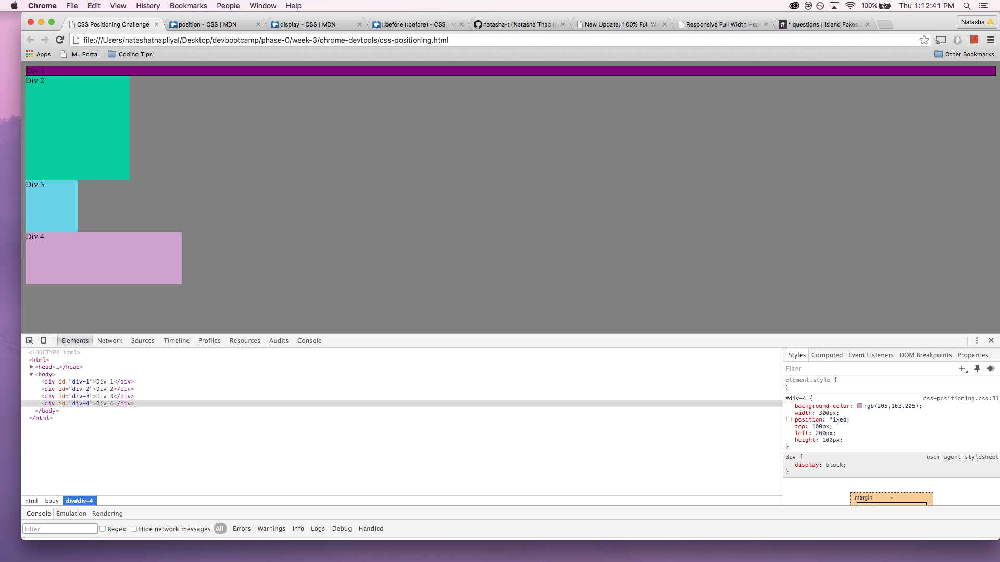
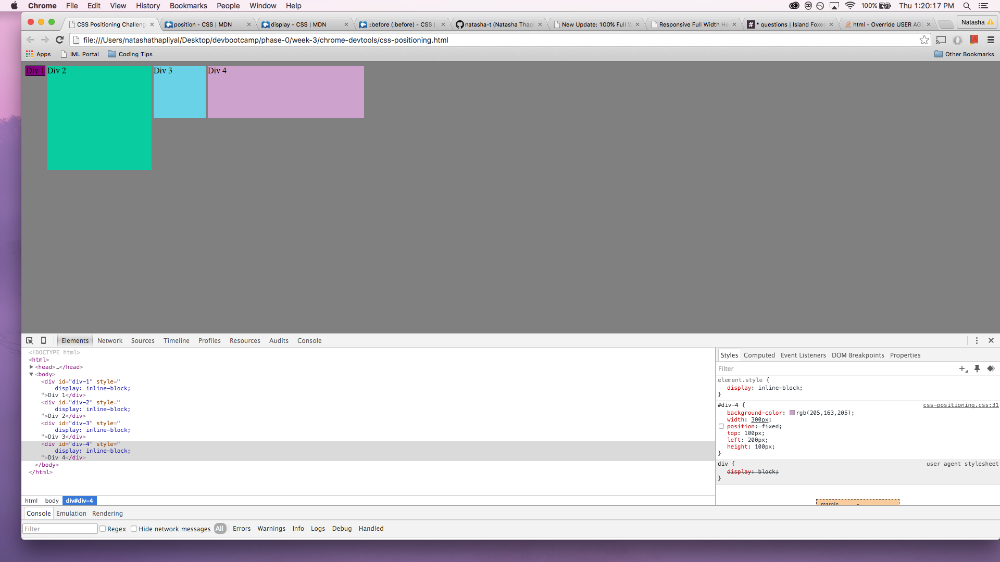
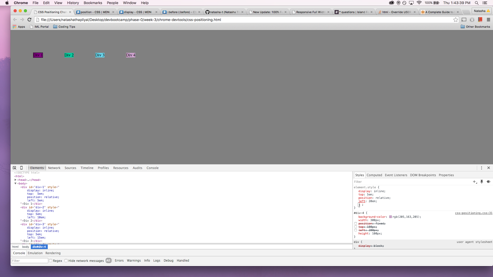
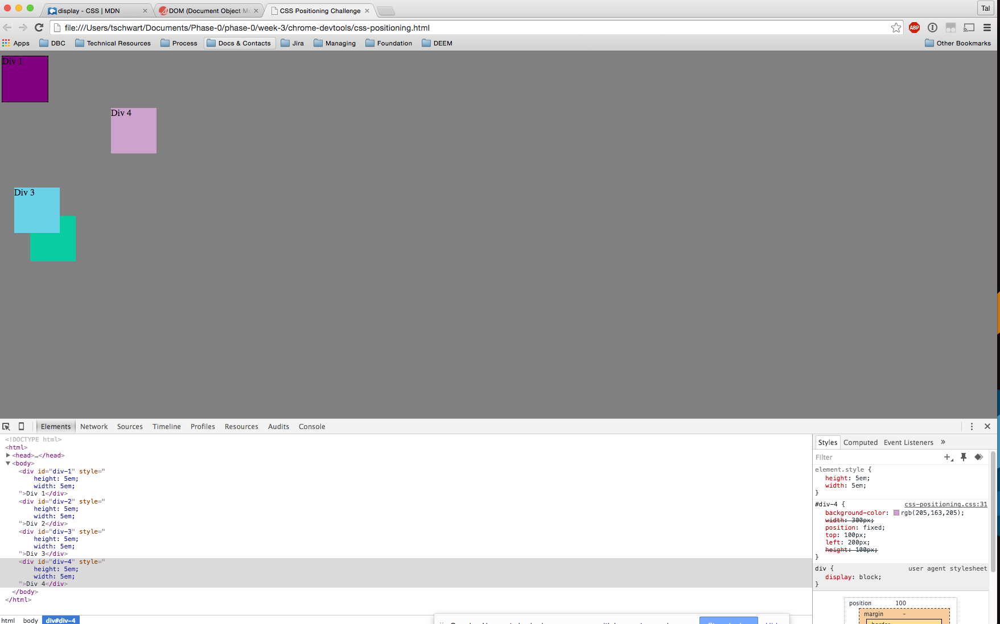
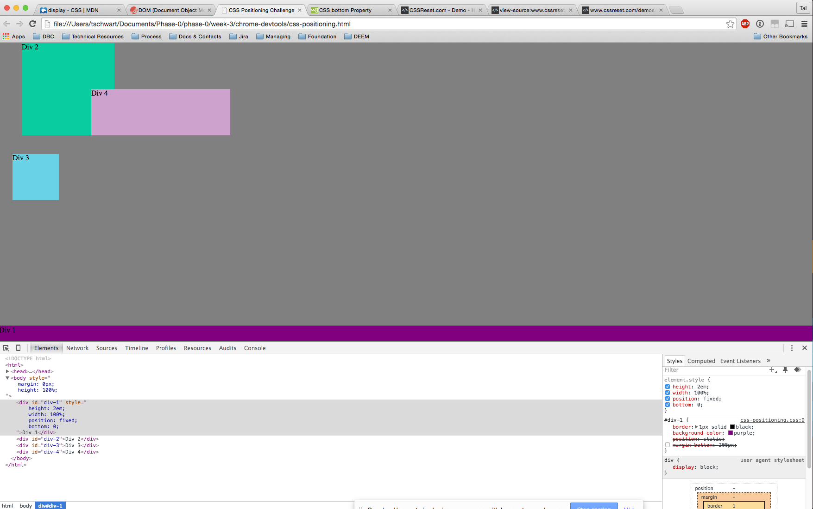
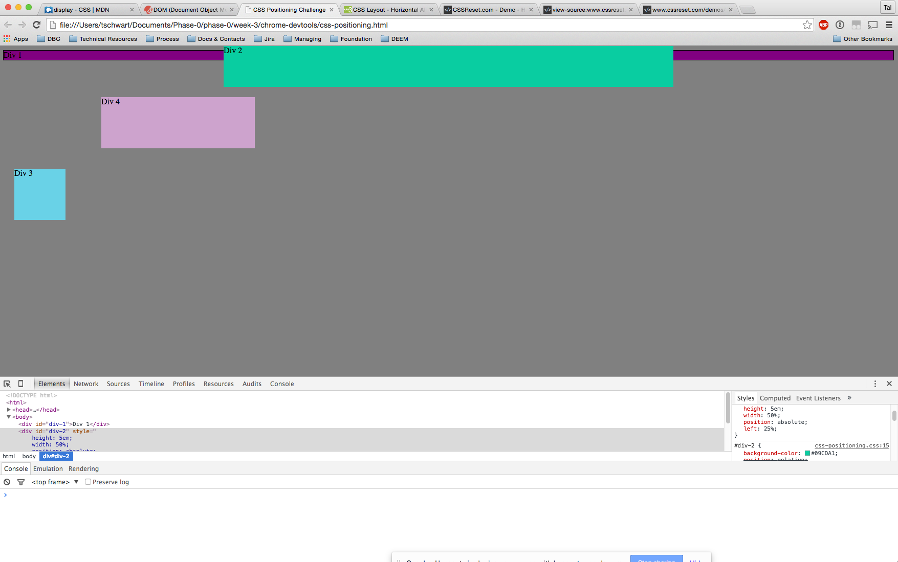
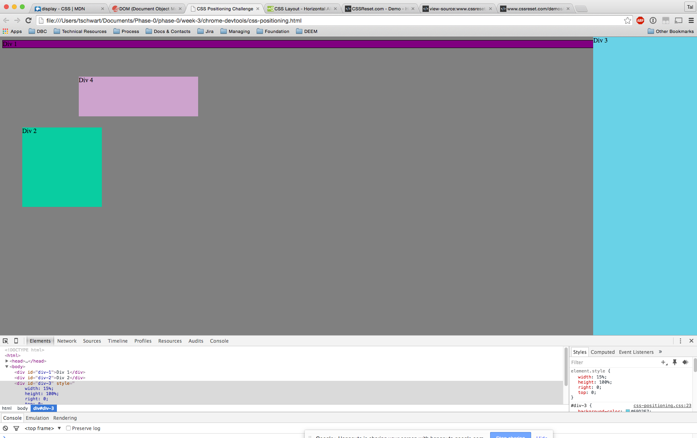
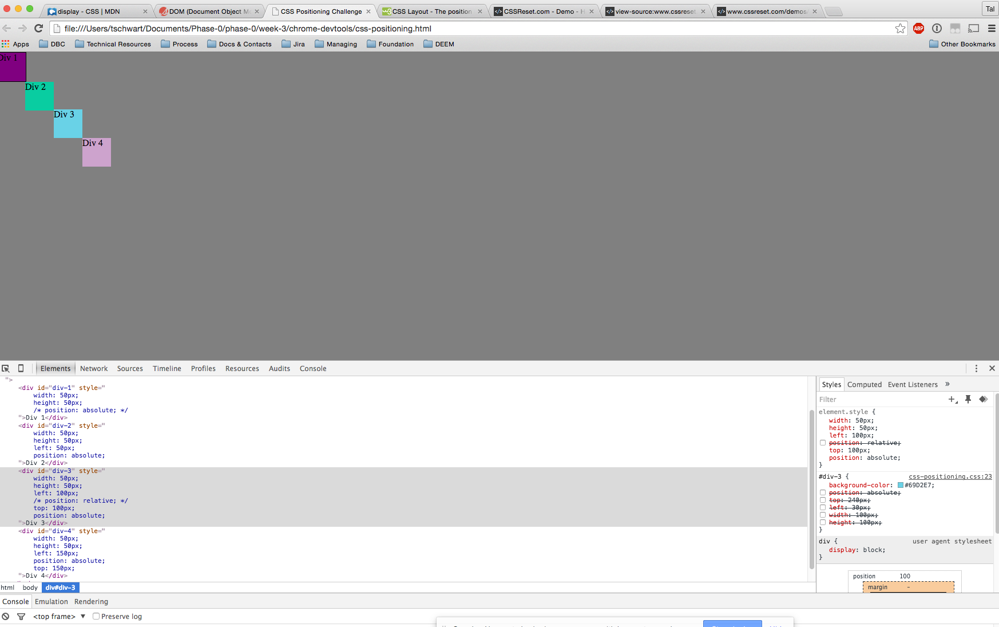

#Positioning Reflection

- *How can you use Chrome's DevTools inspector to help you format or position elements?*
- *How can you resize elements on the DOM using CSS?*
- *What are the differences between Absolute, Fixed, Static, and Relative positioning? Which did you find easiest to use?*
- *Which was most difficult?*
- *What are the differences between Margin, Border, and Padding?*
- *What was your impression of this challenge overall? (love, hate, and why?)*

- Chrome's DevTools is useful because under 'element style {}' you can insert your own styling, as well as uncheck current styling, and see all results instantly in the browser. DevTools also allows you to individually select elements and inspect their properties and what those elements may have inherited from other elements, which is useful in debugging.
- Declaring width and height values can resize elements in the DOM.
- Static positioning is the default positioning for all elements and refers to its current position in the flow of content. Positioning absolutely places the element relative to its 'closest positioned ancestor or to the containing block'(mdn). Relative positioning places the element in relation to where that element would normally have been if it had not been re-positioned from the flow of content, leaving a gap where its original position would've been. When an element is fixed its position is fixed on the screen and doesn't move when the user scrolls. Static and fixed are the easiest to use/understand, but are not used as often as relative and absolute positioning.
- Relative and absolute positioning are more difficult to grasp because you have to also be aware of the position and relationship of its surrounding elements. This challenge actually further confused me about the two; I'll have to tinker more with the divs in DevTools.
- Margin is the space **_around_** an element, the border **_delineates_** the element, and padding adds space **_within_** the element.
- I feel this challenge helped in some ways but also left me more confused about positioning, especially relative and absolute. I think it can get confusing in DevTools when you have your own element styling coexisting with the css file's styling AND the user agent stylesheet interfering as well. My confusing increased once we started checking and unchecking elements while trying to experiment with what we manually typed in; it was getting a bit unruly. I'll have to slowly and methodically apply either relative or absolute positioning to each element to get a clearer picture of whats going on.
