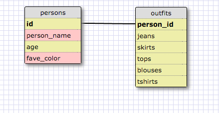

## Database Intro

### Release 5 (took out underscores to not confuse markdown styling)
1. SELECT * FROM states;
2. SELECT * FROM regions;
3. SELECT state name, population FROM states;
4. SELECT state name, population FROM states ORDER BY population DESC;
5. SELECT state name FROM states WHERE region_id = 7;
6. SELECT state name, population density FROM states WHERE population density > 50 ORDER BY population density ASC;
7. SELECT state name FROM states WHERE population BETWEEN 1000000 AND 1500000;
8. SELECT state name, region id  FROM states ORDER BY region id ASC;
9. SELECT region name FROM regions WHERE region name LIKE '%central%';
10. SELECT region name, state name FROM regions, states ORDER BY region id ASC;

### Release 6

### Release 7
- What are databases for?
    - Databases are for storing large amounts of information in the form of tables for easy access, manipulation, and handling.
- What is a one-to-many relationship?
    - A one-to-many relationship refers to when one piece of data refers to multiple pieces of data. For instance, if there is a database of shelter dogs, listing the breeds of the dogs would result in repeating information, since a dog belongs to a breed and a breed has many dogs. So you'd move breeds to another table, then use the id's from the shelter dogs table to refer to its breed in the breed table.
- What is a primary key? What is a foreign key? How can you determine which is which?
    - A primary key is a field that uniquely identifies that row from other rows. The foreign key connects one table to another table using the primary key as a connector. You can tell what are primary keys by identifying if they are simply counting the fields; a foreign key will then use those primary keys to reference each id with new information in another table.
- How can you select information out of a SQL database? What are some general guidelines for that?
    - There are multiple commands that can be used to select. See [W3Schools SQL Guide](http://www.w3schools.com/sql/sql_quickref.asp) for a quick reference guide.