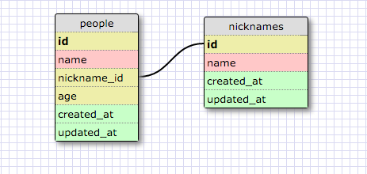
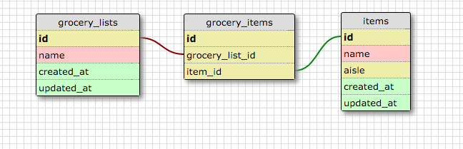

## More Schemas

### Release 2 - One-to-One Schema

A person and his/her nickname is an example of a one-to-one relationship because a person can have at most one (let's say primary) nickname. It is also possible that a person has no nickname or NULL if the nicknames were included in the people table.

### Release 4 - Many to Many Relationships

### Release 6 - Reflect
- What is a one-to-one database?
    - A one-to-one database includes information, stored in two tables, that have a single relationship to one another. You can't have multiple instances of a piece of information for any given data, otherwise it wouldn't be a one-to-one relationship.
- When would you use a one-to-one database? (Think generally, not in terms of the example you created).
    - You'd use a one-to-one database to simplify your schema design and separate information that is still related to each other in a singular way (one row in a table relates to only one other row in another table).
- What is a many-to-many database?
    - A many-to-many database is information that can have multiple relationships to one another.
- When would you use a many-to-many database? (Think generally, not in terms of the example you created).
    - You'd use a many-to-many database if you have rows from one table relating to multiple rows in another table.
- What is confusing about database schemas? What makes sense?
    - Figuring out the relationships between data can be confusing, as well as determining if a separate table is needed if the relationship is one-to-one. I guess once I'm exposed to more types of databases and I analyze their relationships, I'll get a better sense of how all this stuff should be properly organized.